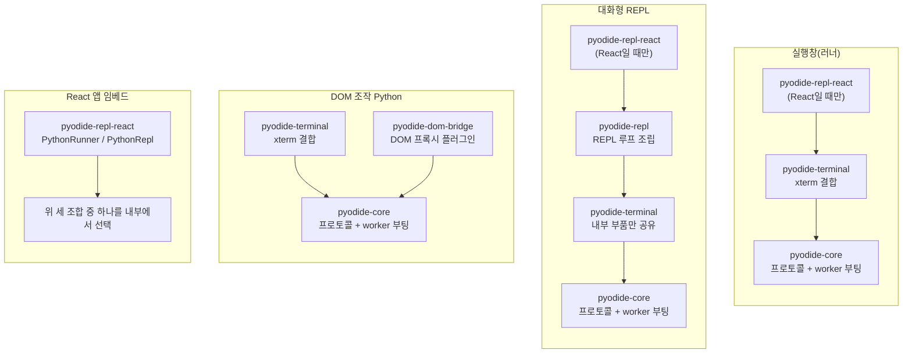

# runo-pyodide

브라우저에서 진짜 Python 3.14 REPL을 띄우는 라이브러리. [Pyodide](https://pyodide.org)를 Web Worker에서 돌리고, [xterm.js](https://xtermjs.org)로 CPython 표준 REPL과 같은 조작감을 낸다 — 메인 스레드는 막히지 않는다.

## 특징

- **`>>> `/`... ` 프롬프트** — 식 값 자동 에코, 트레이스백·`SyntaxError` 표시, 미완성 블록 이어받기
- **`input()`·`sys.stdin`** — 프롬프트 뒤에서 실제 키 입력을 받는다
- **Ctrl+C** — 실행 중이든, `input()` 대기 중이든, `time.sleep()`·`asyncio` 이벤트 루프에 멈춰 있든 즉시 끊는다
- **Tab 완성** — 텍스트 나열 또는 팝오버 선택 상자
- **드래그/Ctrl+C 클립보드 복사**
- Web Worker 격리라 무거운 계산도 UI를 얼리지 않는다

## 패키지

레이어는 아래로 갈수록 저수준이다. 대부분은 `runo-pyodide-repl-react` 하나로 충분하고, 나머지는 React를 안 쓰거나 더 세밀한 제어가 필요할 때 내려간다.

### [`@cp949/runo-pyodide-repl-react`](packages/pyodide-repl-react)

React 컴포넌트·hook 진입점. 대부분은 이것만 쓰면 된다.

- `PythonRepl` — 대화형 REPL 컴포넌트(아래 빠른 시작 예)
- `PythonRunner` — `python main.py`처럼 한 번에 실행하는 실행창 컴포넌트
- `usePythonRunner` — xterm 화면 없이 실행 로직만 붙이는 hook

React `^19.0.0`·`@xterm/xterm` `^6.0.0`이 peer dependency다.

### [`@cp949/runo-pyodide-repl`](packages/pyodide-repl)

REPL 그 자체. `createRepl(options)`으로 xterm `Terminal`에 직접 붙인다. React 없이 다른 프레임워크(또는 바닐라 JS)에서 REPL을 쓸 때 이 계층을 쓴다. 세션 상태(`loading`·`ready`·`load-failed`·`not-isolated`·`terminated`·`crashed`) 관리, `reset()`, 화면 뒤에서 조용히 코드를 실행하는 `runSource()`를 제공한다.

### [`@cp949/runo-pyodide-terminal`](packages/pyodide-terminal)

REPL이 아니라 스크립트 한 편을 처음부터 끝까지 실행하는 실행창(`createTerminalRunner`). `input()` 프롬프트, Ctrl+C 인터럽트, 실행 상태를 xterm에 그대로 반영한다. `pyodide-repl`이 내부적으로 이 패키지의 xterm 결합 부품을 공유한다.

**메인 스레드에서 동작한다** — xterm.js `Terminal`(DOM)에 직접 붙는 패키지라 worker에서 돌 수 없다. `pyodide-core`의 `createRunner`(메인 쪽 API)를 호출해 worker에 실행을 맡기고, worker가 돌려보내는 출력·입력요청 메시지를 xterm 화면에 반영한다. 실제 Python은 항상 worker(`pyodide-core/worker`)에서 실행된다.

### [`@cp949/runo-pyodide-core`](packages/pyodide-core)

프레임워크·UI 비의존 코어. Worker RPC 프로토콜, `input()` 메일박스, interrupt buffer, 코드 한 덩어리를 실행하는 `createRunner`를 제공한다. xterm 없이 `onOutput`·`InputProvider`만으로 커스텀 UI를 만들 때 이 패키지로 내려간다. 위 모든 패키지가 이 위에 얹힌다.

### [`@cp949/runo-pyodide-dom-bridge`](packages/pyodide-dom-bridge)

worker 안 Python 코드에서 메인 페이지의 `window`·`document`를 동기 프록시로 쓰게 하는 선택적 플러그인(`from runo.browser import document`). `createRunner`·`createTerminalRunner`와 조합한다(REPL과는 조합 미지원). Chromium에서만 검증했다.

### [`@cp949/runo-xterm-readline`](packages/xterm-readline)

xterm.js 위에서 줄 편집·history·Tab 완성을 처리하는 readline 구현. [strtok/xterm-readline](https://github.com/strtok/xterm-readline)을 벤더링해 취소 가능한 읽기, 프리필, type-ahead 같은 이 저장소 REPL 전용 동작을 얹었다. 직접 쓰기보다 위 패키지들이 내부적으로 쓴다.

---

`pyodide-testkit`·`eslint-config`·`typescript-config`는 이 저장소 개발용 내부 도구이며 소비자 대상이 아니다.

## 조합 시나리오

패키지 조합에 따라 산출물이 달라진다.



- **실행창(러너)** — REPL 프롬프트 없이 코드 실행 결과만 xterm에 출력. Ctrl+C·abort 지원.
  - `pyodide-core`: worker 부팅·RPC·`input()` 메일박스·interrupt buffer, 실제 Python 실행 지점(`createRunner`)
  - `pyodide-terminal`: worker가 보낸 실행 결과를 xterm 화면에 대신 출력하고, xterm에서 받은 입력·Ctrl+C를 worker로 대신 전달함(`pyodide-core`는 화면을 모르므로 화면 담당을 여기서 붙인다)
  - (React) `pyodide-repl-react`: `PythonRunner`/`usePythonRunner`로 React 수명(mount/unmount·StrictMode)에 결합
- **대화형 REPL** — 한 줄씩 입력받는 실제 Python REPL. `runSource()`로 호스트가 코드를 주입해 실행시킬 수도 있다.
  - `pyodide-core`: 위와 동일(프로토콜·worker 부팅)
  - `pyodide-terminal`: REPL이 내부적으로 공유해 쓰는 xterm 결합 부품(`./internal` — sink·프롬프트 행 등)만 제공, REPL 조립 자체는 안 함
  - `pyodide-repl`: REPL 루프(`>>> `/`... ` 프롬프트, 값 에코, 트레이스백, Tab 완성) 조립, `createRepl`/`runSource`
  - (React) `pyodide-repl-react`: `PythonRepl` 컴포넌트로 위 조립을 React에 결합
- **DOM 조작 Python** — worker의 Python이 main의 `window`·`document`를 동기 프록시로 건드린다(`from runo.browser import document`). REPL과의 조합은 미지원.
  - 위 실행창 조합(`pyodide-core` + `pyodide-terminal`) 그대로
  - `pyodide-dom-bridge`: worker 부팅에 끼어드는 플러그인. Python → DOM 프록시 통로만 추가(coincident에 의존하는 유일한 패키지)
- **React 앱에 임베드** — 온라인 코딩 에디터, 인터랙티브 튜토리얼, 대시보드에 붙는 Python 콘솔 등.
  - `pyodide-repl-react`: `PythonRunner`/`PythonRepl` 컴포넌트, `PythonRunnerHandle`/`PythonReplHandle`로 명령형 제어. 내부적으로 위 세 조합 중 하나를 골라 씀

공통: `pyodide-terminal`·`pyodide-repl`은 줄 편집·history·Tab 완성에 `xterm-readline`을 쓴다(직접 다루지 않음).

`apps/demo`가 세 화면(`?view=runner`, `?view=dom-bridge`, 기본 REPL)으로 예시를 보여준다.

## dom-bridge 예제: canvas에 그리고 xterm에 출력

Python 한 코드에서 두 가지가 동시에 나간다: `document`로 canvas에 그리기(dom-bridge 채널), `print()`는 xterm에 출력(core 채널, `pyodide-terminal`이 그린다).

```tsx
// dom-bridge.worker.ts
import { domBridge } from "@cp949/runo-pyodide-dom-bridge/worker"; // 첫 줄
import { runDriver, runWorker } from "@cp949/runo-pyodide-core/worker";
runWorker({ driver: runDriver, plugins: [domBridge()] });
```

코드는 컴포넌트가 알아서 실행하지 않는다. `ref`로 handle을 잡고 `.run(code)`를 호출해야 실행된다(버튼 클릭 등, 앱이 실행 시점을 정한다).

```tsx
// App.tsx
import { createBridgeMain } from "@cp949/runo-pyodide-dom-bridge";
import {
  PythonRunner,
  type PythonRunnerHandle,
} from "@cp949/runo-pyodide-repl-react";
import { useRef } from "react";

const { Worker } = createBridgeMain();
const createWorker = () =>
  new Worker(new URL("./dom-bridge.worker.ts", import.meta.url), {
    type: "module",
  });

const CODE = `
from runo.browser import document

ctx = document.getElementById("c").getContext("2d")
ctx.fillStyle = "red"
ctx.fillRect(10, 10, 80, 50)

print("canvas에 그렸다")  # 이 줄은 xterm에 출력된다
`;

export function App() {
  const ref = useRef<PythonRunnerHandle>(null);
  return (
    <>
      <canvas id="c" width={200} height={100} />
      <button onClick={() => ref.current?.run(CODE)}>run</button>
      <PythonRunner
        ref={ref}
        createWorker={createWorker}
        style={{ height: 300 }}
      />
    </>
  );
}
```

## 빠른 시작

React 컴포넌트로 REPL 하나를 화면에 띄우는 최소 예:

```tsx
// repl.worker.ts
import { runReplWorker } from "@cp949/runo-pyodide-repl/worker";
runReplWorker();
```

```tsx
// App.tsx
import { PythonRepl } from "@cp949/runo-pyodide-repl-react";
import "@xterm/xterm/css/xterm.css";

const createWorker = () =>
  new Worker(new URL("./repl.worker.ts", import.meta.url), {
    type: "module",
  });

export function App() {
  return <PythonRepl createWorker={createWorker} style={{ height: 480 }} />;
}
```

React 없이 xterm `Terminal`에 직접 붙이려면 `@cp949/runo-pyodide-repl`의 `createRepl(options)`을 쓴다. 한 번에 실행만 필요하면(REPL 아님) `@cp949/runo-pyodide-terminal`의 `createTerminalRunner`나 `@cp949/runo-pyodide-repl-react`의 `PythonRunner`/`usePythonRunner`를 쓴다.

## 호스팅 요구

페이지가 cross-origin isolated여야 한다(Pyodide가 `SharedArrayBuffer`를 쓴다). 응답 헤더:

```text
Cross-Origin-Opener-Policy: same-origin
Cross-Origin-Embedder-Policy: require-corp
```

dev·preview·정적 배포 모두 필요하다. 헤더가 없는 페이지에서는 세션을 시작하지 않고 터미널에 경고만 낸다(상태 `not-isolated`).

## 상태

미배포.

## 라이선스

`packages/xterm-readline`은 Erik Bremen의 xterm-readline(MIT)을 벤더링한 것이다. 원본 고지는 그 패키지의 `LICENSE-MIT`에 있다.
